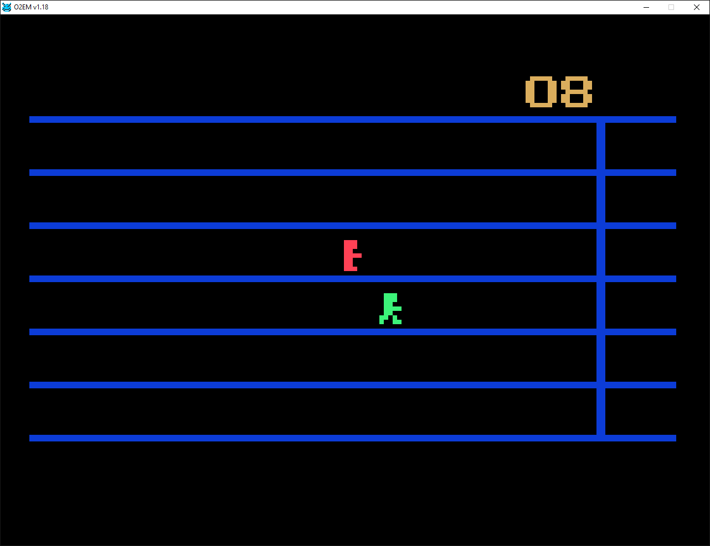

# Le Sprint

A two-player running game for the Philips Videopac G7000, written in Intel 8048 assembly. The game was published in Skrolli Party 2026.

Race to the finish line by alternating your joystick left and right. The faster you alternate, the faster your runner moves!



## Platform

- Philips Videopac G7000 (PAL, 50 Hz timing) and variants. The G7400 has not been tested, but it should work.
- `lesprint.bin` is a 2 KB cartridge ROM image.
- The screenshot shows the game running in O2EM v1.18.

## How to play

1. Wait for the yellow **3, 2, 1** countdown and the starting sound.
2. Player 1 controls the **red runner**; player 2 controls the **green runner**.
3. Alternate **left and right** on your joystick to move toward the finish line.
4. Each runner's finish time appears beside their lane.
5. Once both runners have finished, press the fire button on **each controller** to start another race. The presses do not need to be simultaneous.

Timing uses PAL frames, with hundredths advancing in steps of two.

## Run

Use `lesprint.bin` with O2EM and a suitable Videopac BIOS. Place the ROM in the emulator's `ROMS` directory, then run this command from the O2EM directory:

```bat
o2em.exe lesprint.bin
```

Configure both players' joystick or keyboard controls in the emulator. The game expects PAL timing.

## Build

Build the game with Alfred Arnold's AS assembler, using `g7000.h` for the Videopac hardware and BIOS definitions. Assemble `lesprint.a48`, then convert the output to a 2 KB cartridge ROM image with the assembler's binary conversion utility.

## Files

| File | Description |
| --- | --- |
| [lesprint.a48](lesprint.a48) | Game source code |
| [lesprint.bin](lesprint.bin) | Cartridge ROM image |
| [g7000.h](g7000.h) | Videopac hardware and BIOS definitions |
| [lesprint.png](lesprint.png) | Gameplay screenshot |
